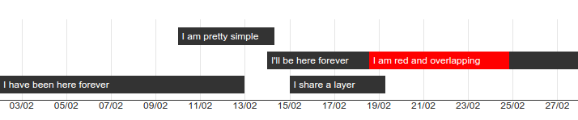

# multi-timeline.js
## Visualisation and management of multiple timelines

### Install it
 
Include [`jquery.js`](http://jquery.com/), [`moment.js`](http://momentjs.com/) and `multi-timeline.js`:

    
    
    
    
Include `multi-timeline.min.css`: 

    <link rel="stylesheet" href="../dest/multi-timeline.min.css"/>

Create the root element that holds your timelines:

    

    
### Initalize it

    $('.multi-timeline').multiTimeline({
        data: [
            {
                title: 'Entry',
                start: '2015-02-22',
                end:   '2015-02-24'
            },{
                title: 'Another Entry',
                start: '2015-02-23',
                end:   '2015-02-28'
            }
      ]
    });
    
### Configuration

These are possible config values. Shown are defaults.

    $('.multi-timeline').multiTimeline({
        start:            '2015-02-21',             // Start of the timeline. Default is today -7 days
        end:              '2015-03-04',             // End of the timeline. Default is today +7 days
        zoom:             5,                        // Initial zoom level. 
        zoomStep:         1,                        // Number of days added before `start` and after `end` when zooming   
        zoomOutControl:   $('.zoom-out'),           // Element to trigger zoomOut on click
        zoomInControl:    $('.zoom-in'),            // Element to trigger zoomIn on click
        goRightControl:   $('.go-right'),           // Element to trigger goRight on click
        goLeftControl:    $('.go-left'),            // Element to trigger goLeft on click
        maxLabelCount:    20,                       // Max count of x-axis labels (lower it if your labels overlap)
        timelineSpacing:  30,                       // Vertical margin in pixels between two timelines 
        dateFormat:       'DD/MM',                  // x-axis date format (moment.js format) 
        onZoomChange:     function(newZoom) {       // Executed when zoom changes
            
        },
        onTimelineClick:  function(event, data) {  // Executed when a timeline is clicked. Receives js event and
                                                  // data specified in `data`
        },
        data: []                                  // Timeline data (see below)
    });
    
### Timeline data

Each timeline is specified as an object and can receive the following attributes. All attributes are optional.
 
    {
        title:  'Title of your timeline',   
        start:  '2015-02-22 18:00:00',      // ISO_8601 date (with or without time)     
        end:    '2015-02-24',               // ISO_8601 date (with or without time)
        color:  '#f00',                     // background-color, is set via inline style-attribute
        class:  'important',                // Additional class for .tl-timeline elements
        zIndex: 10,                         // z-index for this timeline (to manage overlaps)
        
        layer: 0                           // Each timeline is on it's own layer (always one higher than the one 
                                           // before). If you set a specific layer, it's possible for to 
                                           // timelines to share the same layer.
    }
    
If the `start` or `end` attributes are not specified, the timeline becomes infinite in corresponding direction.

### External controls

You can specifiy elements to trigger certain events:

    zoomOutControl: $('.zoom-out')     // Zooms out 1 zoomStep on click
    zoomInControl:  $('.zoom-in')      // Zooms in 1 zoomStep on click
    goRightControl: $('.go-right')     // Pans the timeline to the right
    goLeftControl:  $('.go-left')      // Pans the timeline to the left
    
#### External zoom slider

Use the `onZoomChange` event to update a range-input. Use the `setZoom()` method to update the zoom level of
your timeline:

    <input type="range" min="0" max="40" value="5" class="js-set-zoom">
    